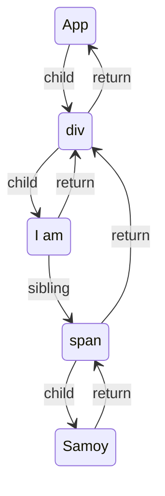

React自从 React 16 版本引入 Fiber 架构后，渲染过程变得更加精细和可控。整个更新流程主要可以分为三个关键模块：Scheduler（调度器）、Reconciler（协调器） 和 Renderer（渲染器）。

## 关键模块

### Scheduler（调度器）

* 调度器是React内部的一个核心模块，它负责决定何时以及如何执行更新任务。在React应用中，当状态发生变化时，会触发重新渲染，而调度器的作用就是根据任务优先级将这些更新任务排队。

* Scheduler 遵循可中断的工作循环模型，允许高优先级的任务中断低优先级的渲染任务，从而确保了用户交互等重要操作不会被阻塞。例如，它可以确保动画帧请求等具有时间敏感性的任务能够得到及时处理。

* Scheduler 还会考虑浏览器环境的特性，如使用`requestIdleCallback` API 在浏览器空闲时段进行批处理更新，以避免阻塞主线程并提高性能。

### Reconciler（协调器）

* 协调器在React 16及以后版本中对应Fiber架构，它的核心工作是遍历React组件树，通过算法找出需要更新的组件，并创建或更新对应的Fiber节点。

* 算法会对比新旧虚拟DOM树，标记出有差异的部分，而不是盲目地整体刷新UI。这个过程中，每个Fiber节点代表一个可中断的单元，使得React能够在任何阶段暂停和恢复渲染过程。

* 协调器会生成更新计划，记录下所有需要变更的状态和DOM操作，但并不直接修改DOM，而是将这些信息传递给Renderer。

### Renderer（渲染器）

* 渲染器负责实际的DOM操作。它依据协调器提供的更新计划，在适当的时候将React组件树映射到真实的DOM结构上，执行实际的DOM更新操作。

* 在不同的环境中，比如浏览器环境和服务器环境，甚至原生移动应用环境，Renderer会有不同的实现。例如 ReactDOM 是用于浏览器环境的渲染器，而 React Native 则提供了针对原生移动平台的渲染器。

## 虚拟DOM

### 1. 什么是虚拟DOM？

虚拟DOM（Virtual DOM）是一种用JavaScript对象结构来表示网页DOM树结构的技术，它模拟了真实DOM节点的属性和层级关系。

### 2. 为什么使用虚拟DOM而不使用真实DOM？

* 真实DOM的操作代价高昂，尤其是当页面结构复杂时，频繁的添加、删除和修改DOM节点会导致重绘与回流，这会严重影响浏览器渲染性能。
* 虚拟DOM通过在内存中进行计算和比较，找出需要更新的真实DOM部分，然后批量地应用这些更改到真实DOM。这样可以减少不必要的DOM操作，从而提高页面渲染速度。
* 虚拟DOM其实是一个JavaScript对象，能够应用于不同的平台。只需替换对应的Renderer即可实现“一次编写，多处运行”。

## 渲染过程
* Reconciler工作的阶段被称为render阶段。因为在该阶段会调用组件的render方法。
* Renderer工作的阶段被称为commit阶段。commit阶段会把render阶段提交的信息渲染在页面上。
* render与commit阶段统称为work，即React在工作中。相对应的，如果任务正在Scheduler内调度，就不属于work。

### Render阶段
render阶段开始于`performSyncWorkOnRoot`或`performConcurrentWorkOnRoot`方法的调用。这取决于本次更新是同步更新还是异步更新。
```javascript
// performSyncWorkOnRoot会调用该方法
function workLoopSync() {
  while (workInProgress !== null) {
    performUnitOfWork(workInProgress);
  }
}

// performConcurrentWorkOnRoot会调用该方法
function workLoopConcurrent() {
  while (workInProgress !== null && !shouldYield()) {
    performUnitOfWork(workInProgress);
  }
}
```
可以看到，他们唯一的区别是是否调用`shouldYield`。如果当前浏览器帧没有剩余时间，`shouldYield`会中止循环，直到浏览器有空闲时间后再继续遍历。

`workInProgress`代表当前已创建的`workInProgress fiber`。

`performUnitOfWork`方法会创建下一个Fiber节点并赋值给`workInProgress`，并将`workInProgress`与已创建的`Fiber`节点连接起来构成`Fiber`树。

`performUnitOfWork`的工作可以分为两部分：“递”和“归”。

#### “递”阶段
首先从`rootFiber`开始向下深度优先遍历。为遍历到的每个`Fiber`节点调用[`beginWork`](#beginwork)方法。

该方法会根据传入的`Fiber`节点创建子`Fiber`节点，并将这两个`Fiber`节点连接起来。

当遍历到叶子节点（即没有子组件的组件）时就会进入“归”阶段。

#### “归”阶段

在“归”阶段会调用[`completeWork`](#completework)处理`Fiber`节点。

当某个Fiber节点执行完`completeWork`，如果其存在兄弟`Fiber`节点（即`fiber.sibling !== null`），会进入其兄弟`Fiber`的“递”阶段。

如果不存在兄弟`Fiber`，会进入父级`Fiber`的“归”阶段。

“递”和“归”阶段会交错执行直到“归”到`rootFiber`。至此，`render`阶段的工作就结束了。

#### 例子
```jsx
function App() {
  return (
    <div>
      I am
      <span>Samoy</span>
    </div>
  )
}

ReactDOM.render(<App />, document.getElementById("root"));
```
对应的Fiber树如下：

render的阶段会依次执行：
```
1. rootFiber beginWork
2. App Fiber beginWork
3. div Fiber beginWork
4. "i am" Fiber beginWork
5. "i am" Fiber completeWork
6. span Fiber beginWork
7. span Fiber completeWork
8. div Fiber completeWork
9. App Fiber completeWork
10. rootFiber completeWork
```
注意：之所以没有 “Samoy” Fiber 的 [beginWork](#beginwork)/[completeWork](#completework)，是因为作为一种性能优化手段，针对只有单一文本子节点的`Fiber`，`React`会特殊处理。

#### beginWork
beginWork方法会创建子`Fiber`节点并将其连接到`Fiber`树上。
```typescript
function beginWork(
  current: Fiber | null,
  workInProgress: Fiber,
  renderLanes: Lanes,
): Fiber | null {
  // ...省略函数体
}
```
其中传参：
* current：当前组件对应的Fiber节点在上一次更新时的Fiber节点，即workInProgress.alternate
* workInProgress：当前组件对应的Fiber节点
* renderLanes：优先级相关
`beginWork`的工作可以分为两部分：
1. `update`时：如果`current`存在，在满足一定条件时可以复用`current`节点，这样就能克隆`current.child`作为`workInProgress.child`，而不需要新建`workInProgress.child`.
2. `mount`时：当`current === null`。会根据fiber.tag不同，创建不同类型的子Fiber节点.
beginWork流程图如下：


#### completeWork
类似`beginWork`，`completeWor`k也是针对不同`fiber.tag`调用不同的处理逻辑。
当`update`时，`Fiber`节点已经存在对应DOM节点，所以不需要生成DOM节点。需要做的主要是处理`props`，比如：

* `onClic`k、`onChange`等回调函数的注册
* 处理`style prop`
* 处理`DANGEROUSLY_SET_INNER_HTML prop`
* 处理`children prop`

`mount`时的主要逻辑包括三个：

* 为Fiber节点生成对应的DOM节点
* 将子孙DOM节点插入刚生成的DOM节点中
* 与`update`逻辑中的`updateHostComponent`类似的处理`props`的过程

completeWork流程图如下：


### Commit阶段
commit阶段开始于`commitRoot`方法的调用。
commit阶段的主要工作分为三部分：
1. before mutation阶段（执行DOM操作前）
2. mutation阶段（执行DOM操作）
3. layout阶段（执行DOM操作后）

#### before mutation阶段
在`before mutation`阶段，会遍历`effectList`，依次执行：

1. 处理DOM节点渲染/删除后的 `autoFocus`、`blur`逻辑
2. 调用`getSnapshotBeforeUpdate`生命周期钩子 （注意：从Reactv17开始，`componentWillXXX`钩子前增加了`UNSAFE_`前缀，
究其原因，是因为重构为Fiber架构后，`render`阶段的任务可能中断/重新开始， 对应的组件在`render`阶段的生命周期钩子
（即`componentWillXXX`）可能触发多次。这种行为和Reactv16不一致，所以标记为`UNSAFE_`。
为此，React提供了替代的生命周期钩子`getSnapshotBeforeUpdate`。）
3. 调度`useEffect`。

#### mutation阶段
类似`before mutation`阶段，`mutation`阶段也会遍历`effectList`，执行函数，这里执行的是`commitMutationEffects`。
该函数的主要工作是根据`effectTag`调用不同的处理函数处理`Fiber`。

#### layout阶段
该阶段之所以称为`layout`，因为该阶段的代码都是在DOM渲染完成（`mutation`阶段完成）后执行的。

该阶段触发的生命周期钩子和hook可以直接访问到已经改变后的DOM，即该阶段是可以参与`DOM layout`的阶段。

与前两个阶段类似，`layout`阶段也是遍历`effectList`，执行函数。这里执行的是`commitLayoutEffects`。该函数的主要工作是
根据effectTag调用不同的处理函数处理`Fiber`并更新`ref`。

## Diff算法
Diff算法是一种高效的比较算法，用于计算虚拟DOM（Virtual DOM）中两个不同树结构的最小差异。
当组件的状态或属性发生变化时，React会生成一个新的虚拟DOM树，并与上一次渲染的结果进行比较。这个过程就是所谓的Diff算法。
由于Diff操作本身也会带来性能损耗，React文档中提到，即使在最前沿的算法中，将前后两棵树完全比对的算法的复杂程度为 O(n<sup>3</sup>)，其中n是树中元素的数量。
如果在React中使用了该算法，那么展示1000个元素所需要执行的计算量将在十亿的量级范围。这个开销实在是太过高昂。

为了降低算法复杂度，React的diff会预设三个限制：
1. 只对同级元素进行Diff。如果一个DOM节点在前后两次更新中跨越了层级，那么React不会尝试复用他。
2. 两个不同类型的元素会产生出不同的树。如果元素由div变为p，React会销毁div及其子孙节点，并新建p及其子孙节点。
3. 开发者可以通过 key prop来暗示哪些子元素在不同的渲染下能保持稳定。

### Diff是如何实现的
### 单节点Diff
实现流程如下：

### 多节点Diff

## Hooks

## 参考文献

> [React技术解密](https://kasong.gitee.io/just-react/)
