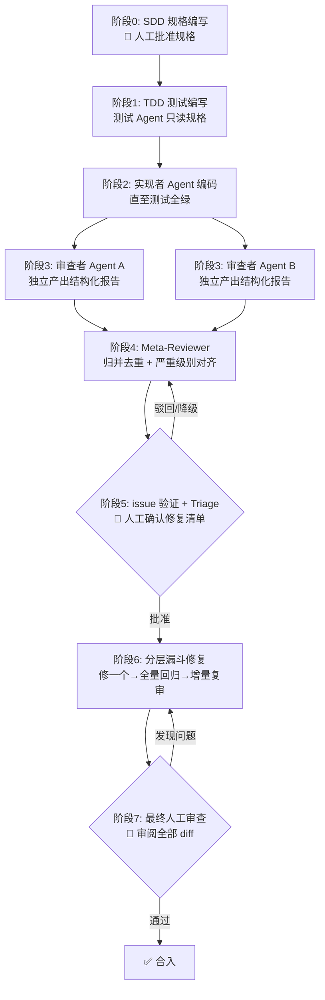

> 适用场景：Vibe Coding 中利用 AI 生成/修改代码，通过「规格驱动 + 测试驱动 + 多 Agent 交叉审查 + 人工兜底」构建可信交付流水线。
>
> 核心理念：**AI 生成的代码天然不可信，可信度不来自任何单个 Agent，而来自结构化的制衡机制。**

---

## 一、核心思想


| 原则 | 说明 |
|------|------|
| 规格是唯一事实源 | 代码是否符合预期，以 SDD 规格文档为准，而非任何 Agent 的"解释" |
| 测试是唯一验收器 | 所有结论必须能被可执行的测试用例证实或证伪，拒绝"我觉得没问题" |
| 独立产生信息量 | 两个高度相关的审查者等于一个人看两遍；多样性是交叉审查的生命线 |
| 共识提升精确率，并集提升召回率 | 双 Agent 报告取交集 → 高置信 issue；取并集 → 全量疑似清单 |
| 证据先于结论 | 每个 issue 必须附带文件/行号/失败用例/复现步骤，否则不予受理 |
| 修复前必须验证 | 无法复现的 issue 不修，进低优积压 |
| 人工检查点前移 | 人工不只做最终防线，还要在"修复前 triage"把关，避免 AI 在伪问题上空转 |

---

## 二、原始流程评估


### 2.1 合理之处

1. **SDD + TDD 作为约束框架**：把 AI 的自由度限制在规格与测试之间，是业界验证过有效的做法。
2. **双 Agent 独立分析**：本质是集成学习中的投票机制，单 Agent 漏报的问题大概率能被另一个捕获。
3. **"相同且高优"优先修复**：交集策略保守但精确，显著降低修复伪 issue 的概率。
4. **分层漏斗修复顺序**：共识高优 → 单源高优 → 次要问题，符合风险收益比。
5. **人工审核兜底**：AI 全流程中人工是不可省略的最终裁决者。

### 2.2 需要补强的盲区

| # | 盲区 | 风险 | 对策 |
|---|------|------|------|
| 1 | 两个审查 Agent 使用同一模型、同一提示词 | 相关失效：共同的知识盲区导致"共识"是虚假共识 | 审查者多样性策略（见 §5.1） |
| 2 | 报告为自由文本，依赖 Meta-Reviewer 语义比对 | 同一问题因措辞不同被判为不同 issue；或不同问题被误合并 | 强制结构化 issue 格式（见 §6） |
| 3 | 交叉出的 issue 直接开修 | 修了不存在/无法复现的问题，甚至引入回归 | 修复前验证关卡（见 §4 阶段 5） |
| 4 | 修复后没有回归与复审闭环 | 修 A 坏 B，流程在"修完"即宣告结束 | 修复 → 全量回归 → 增量复审（见 §4 阶段 6） |
| 5 | 人工审核只在最后 | AI 可能在伪 issue 上消耗大量修复成本后才被发现 | 人工检查点前移至 triage（见 §4 阶段 5） |
| 6 | 两份报告冲突时无裁决机制 | A 报高优、B 报无问题的 issue 去向不明 | 争议 issue 处理规则（见 §7.3） |
| 7 | 两个 Agent 的"高优"标准不一 | 严重级别不可比，漏斗排序失真 | 统一严重级别矩阵（见 §6.2） |
| 8 | 没有退出条件 | 审查-修复循环无限进行，成本失控 | 退出标准与预算管理（见 §9） |

---

## 三、角色定义


| 角色 | 职责 | 关键约束 |
|------|------|----------|
| 规格撰写者（人 + AI 辅助） | 编写/审定 SDD 规格文档 | 规格必须经人工批准后才能进入实现 |
| 测试工程师 Agent | 依据规格编写测试用例 | **禁止读取实现代码**，只读规格，防止测试迁就实现 |
| 实现者 Agent | 按规格实现代码，直至测试全绿 | 禁止修改规格与测试；若认为测试有误，只能提交异议而非直接改测试 |
| 审查者 Agent A / B | 基于测试用例与规格独立产出 issue 报告 | 相互隔离、互不可见对方输出；必须附证据 |
| Meta-Reviewer Agent | 合并、去重、对齐两份报告，产出统一 issue 清单 | 只做归并与匹配，**不得新增或删改 issue 内容** |
| 验证者（脚本/人） | 对每个 issue 执行复现验证 | 无法复现的 issue 降级入积压 |
| 修复者 Agent | 按漏斗顺序逐个修复 | 每次只修一个 issue；修完跑全量测试 |
| 人工评审者 | 批准 triage 清单、最终审阅 diff | 拥有一票否决权 |

> **铁律：写代码的不审代码，写测试的不实现功能，审报告的不修 issue。角色分离是多 Agent 制衡的基础。**

---

## 四、完整流程（8 个阶段）




### 阶段 0：规格先行（SDD）

- 用规格文档明确：功能边界、输入输出契约、错误处理策略、非功能要求。
- **检查点：人工批准规格**。规格模糊是后续所有 Agent 误判的根源。

### 阶段 1：测试先行（TDD）

- 测试工程师 Agent **只依据规格**编写测试，覆盖：正常路径、边界值、错误路径、规格中明确列出的约束。
- 每个测试用例标注它验证的规格条目 ID（可追溯性）。
- **反自证约束**：测试一经人工/规格确认，实现者 Agent 无权修改；对测试的异议必须走显式流程。

### 阶段 2：实现

- 实现者 Agent 编码并自跑测试，直至全绿。
- 测试未全绿不进入审查阶段——**红色测试进审查是浪费所有下游 Agent 的成本**。

### 阶段 3：双 Agent 独立审查

- 两个审查 Agent **并行、隔离**运行，输入相同：规格文档 + 测试用例 + 实现代码。
- 输出统一格式的 issue 报告（见 §6）。
- 多样性要求见 §5.1。

### 阶段 4：Meta-Reviewer 归并

- 输入两份报告，输出统一清单，分为四类：
  - **共识 issue**：双方均报告（含措辞不同但本质相同的情况）
  - **单源 issue**：仅一方报告
  - **冲突 issue**：一方报问题、另一方明确判定无问题
  - **去重说明**：被合并的条目及其映射关系
- 按 §6.2 的统一矩阵对齐严重级别。**Meta-Reviewer 不得自行新增或改写 issue**，防止归并环节引入幻觉。

### 阶段 5：验证 + 人工 Triage（检查点 ①）

1. 自动/人工验证每个高优 issue 是否可复现（跑对应用例或最小复现脚本）。
2. 不可复现 → 降级为低优积压，附"无法复现"标记。
3. **人工确认最终修复清单与顺序**。这是修复成本发生前的最后把关，也是原始流程中最值得前移的防线。

### 阶段 6：分层漏斗修复

修复顺序（严格逐级，上一级清零后才进入下一级）：

```
第 1 级：共识 + 高优（双方报告均出现的高优 issue）
第 2 级：单源 + 高优（仅一方报告，但已验证可复现）
第 3 级：共识 + 中低优
第 4 级：单源 + 中低优
第 5 级：积压区（无法复现项，人工定期复核）
```

每个 issue 的修复闭环：

```
修复单个 issue → 跑该 issue 对应的失败用例（转绿）→ 跑全量测试（无回归）
→ 对变更文件做增量复审（可复用单个审查 Agent）→ 下一个 issue
```

**约束：一次只修一个 issue。** 批量修复会让回归归因变得不可能。

### 阶段 7：最终人工审查（检查点 ②）

- 审阅全部累计 diff、规格符合性、以及 AI 流程的元数据（哪些 issue 被驳回、哪些无法复现）。
- 人工发现问题 → 回到阶段 6 作为新 issue 进入漏斗（标记来源为"人工"，自动为最高置信）。

---

## 五、关键设计决策


### 5.1 审查者多样性（对抗相关失效）

两个审查 Agent 的独立性决定交叉审查的信息量。按成本从低到高依次采用：

| 手段 | 说明 | 成本 |
|------|------|------|
| 不同审查视角 | A 侧重逻辑正确性与边界，B 侧重安全、并发与错误处理 | 低 |
| 不同提示词与输出格式约束 | 避免同源提示触发相同思维路径 | 低 |
| 不同温度/采样参数 | 降低同模型输出相关性 | 低 |
| 不同底层模型 | 最有效的手段：不同模型的知识盲区不重叠 | 中 |

> 至少采用前两项；有条件时务必采用"不同底层模型"。

### 5.2 为什么 Meta-Reviewer 只归并不判断

让归并者新增结论，等于在无证据环节引入第三次幻觉源。它的工作是**匹配与对齐**，不是**裁决**。裁决权属于可复现性验证和人工。

### 5.3 冲突 issue 的裁决路径

一方报高优、另一方判无问题时，该 issue 既不自动进入漏斗、也不直接丢弃：

1. 交由验证环节：能复现 → 视同单源高优进入第 2 级；
2. 不能复现但涉及安全/资损类 → 强制人工裁决；
3. 其余进入积压区。

### 5.4 测试自身的可信度

测试是整条流水线的裁判，因此测试本身也要被约束：

- 测试代码同样走双 Agent 审查（审查视角：覆盖度、断言有效性、是否存在永真断言）。
- 抽样做变异测试（Mutation Testing）：故意向实现注入缺陷，检验测试能否捕获。测试杀不死变异体，说明断言形同虚设。

---

## 六、结构化产物规范


### 6.1 Issue 报告格式（审查 Agent 强制输出）

```json
{
  "issue_id": "A-001",
  "title": "并发写入下计数器丢失更新",
  "severity": "high",
  "category": "correctness",
  "spec_ref": "SDD-§3.2",
  "test_ref": "test_counter_concurrent_update",
  "location": { "file": "src/counter.ts", "lines": "42-58" },
  "repro": "并发 100 次 increment，期望 100，实际 87",
  "evidence": "测试 test_counter_concurrent_update 失败日志（附后）",
  "suggested_fix": "将 read-modify-write 改为原子操作"
}
```

硬性要求：

- `location` + `test_ref`/`repro` 缺一不可，缺证据的 issue 直接拒收。
- `spec_ref` 缺失的 issue 标记为"规格外问题"，单独分类（可能是规格遗漏，也可能是审查者发散）。

### 6.2 统一严重级别矩阵

| 级别 | 定义 | 示例 |
|------|------|------|
| **high** | 功能错误、数据损坏、安全漏洞、规格明确条款被违反 | 金额计算错误；SQL 注入；死锁 |
| **medium** | 边界处理不当、性能明显劣化、错误处理缺失但主路径正常 | 超大输入未校验；异常被吞 |
| **low** | 可读性、命名、轻微冗余、不影响正确性的风格问题 | 魔法数字；重复代码片段 |

> 两份报告使用不同级别时，Meta-Reviewer 按本矩阵重新定级，并保留双方原始定级作为审计字段。

### 6.3 Meta-Reviewer 归并输出格式

```json
{
  "consensus": [{ "issue": "...", "sources": ["A-001", "B-003"], "severity": "high" }],
  "single_source": [{ "issue": "...", "sources": ["B-007"], "severity": "medium" }],
  "conflicts": [{ "issue": "...", "reporter": "A-005", "dissenter": "B", "severity": "待裁决" }],
  "merge_notes": [{ "merged_into": "C-001", "duplicates": ["A-001", "B-003"] }]
}
```

---

## 七、提示词模板（参考）

### 7.1 审查 Agent（A / B 各一份，视角不同）

```
你是代码审查者（视角：{逻辑正确性与边界 / 安全与错误处理}）。
输入：规格文档、测试用例、实现代码。
任务：仅报告有证据的问题，每个问题必须包含：文件与行号、对应的失败测试
或可复现步骤、规格条款引用。
严重级别必须按以下矩阵评定：{high/medium/low 定义}。
输出严格遵循 issue JSON Schema。禁止报告无证据的猜测、风格偏好或重构建议。
禁止修改任何代码。
```

### 7.2 Meta-Reviewer

```
你是报告归并者。输入：审查报告 A、审查报告 B。
任务：将两份报告归并为 consensus / single_source / conflicts / merge_notes
四类。判定"同一问题"的标准：同一位置 + 同一根因，措辞不同不影响判定。
你不得新增、改写或评价任何 issue；严重级别按统一矩阵对齐。
输出严格遵循归并 JSON Schema。
```

### 7.3 修复 Agent

```
你是修复者。输入：单个已验证的 issue、规格文档、测试用例、当前代码。
任务：只修复这一个 issue，做最小变更。禁止顺手重构、禁止修改测试与规格。
完成后运行：该 issue 对应测试（必须转绿）+ 全量测试（必须无回归）。
输出：变更说明 + 测试结果。若修复需要改动规格或测试，停止并上报。
```

---

## 八、常见反模式


| 反模式 | 后果 | 正确做法 |
|--------|------|----------|
| 两个审查 Agent 用同模型 + 同提示词 | 虚假共识，交叉审查退化为重复劳动 | 视角分离，尽量换模型 |
| 审查者顺便改代码 | 未经审查的变更混入 | 审查者只读，修复交给修复者 |
| 实现者修改测试以"通过" | 裁判被运动员收买 | 测试冻结 + 异议走显式流程 |
| 批量修复多个 issue 后统一跑测试 | 回归无法归因 | 一次一个 issue，修完即回归 |
| 自由文本报告直接人工肉眼比对 | 漏并、误并，规模不可扩展 | 结构化 Schema + Meta-Reviewer |
| 人工审查只看最后结果 | 伪 issue 的修复成本已经发生 | triage 检查点前移 |
| 无限循环审查直到"零 issue" | 成本失控，低优噪音淹没高优信号 | 明确退出标准（见 §9） |
| 把"AI 说没问题"当作通过依据 | 漏报不可见 | 以测试全绿 + 人工批准为唯一通过依据 |

---

## 九、退出标准与预算管理

**进入最终人工审查的前置条件（全部满足）：**

1. 全部测试绿；
2. 第 1、2 级漏斗清零（共识高优 + 已验证单源高优）；
3. 第 3、4 级按团队策略处理（清零，或显式接受并记录）；
4. 积压区条目均已标记"无法复现"并附原因。

**预算控制建议：**

- 设定审查-修复最大轮次（建议 3 轮）；超过后若仍有新增高优 issue，说明规格或实现存在结构性问题，应回炉到阶段 0，而不是继续打补丁。
- 每轮记录指标：issue 总数 / 共识率 / 伪 issue 率（验证不可复现占比）/ 修复引入回归数。伪 issue 率持续高于 30% 时，优先优化审查提示词而非增加审查轮次。

---

## 十、执行清单（Checklist）

### 规格与测试
- [ ] 规格文档经人工批准
- [ ] 测试由独立 Agent 仅依据规格编写
- [ ] 每个测试标注对应规格条目
- [ ] 测试代码本身经过审查（含抽样变异测试）

### 审查
- [ ] 审查 Agent A / B 并行隔离运行，视角或模型已差异化
- [ ] 两份报告均为结构化格式，证据字段完整
- [ ] Meta-Reviewer 仅归并不裁决
- [ ] 严重级别按统一矩阵对齐

### 修复
- [ ] 每个高优 issue 经过复现验证
- [ ] 修复清单与顺序经人工确认（检查点 ①）
- [ ] 一次只修一个 issue，修完跑全量回归
- [ ] 变更文件经增量复审
- [ ] 漏斗逐级清零，退出标准全部满足

### 人工
- [ ] 最终 diff 审阅完成（检查点 ②）
- [ ] 积压区与驳回项已记录归档
- [ ] 流程指标已记录，用于下一轮迭代改进

---

## 附：与原始流程的差异速查

| 环节 | 原始流程 | 本文流程 |
|------|----------|----------|
| 审查者配置 | 两个 Agent（未限定差异） | 强制视角/模型多样性 |
| 报告格式 | 自由报告 | 结构化 JSON，证据强制 |
| 交叉后动作 | 直接修复 | 先复现验证，再人工 triage |
| 人工检查点 | 仅最后防线 | triage（修复前）+ 最终审查，双检查点 |
| 修复方式 | 按优先级批量修 | 单 issue 闭环 + 全量回归 + 增量复审 |
| 冲突处理 | 未定义 | 验证裁决 + 安全类强制人工 |
| 退出条件 | 未定义 | 漏斗清零标准 + 最大轮次预算 |
