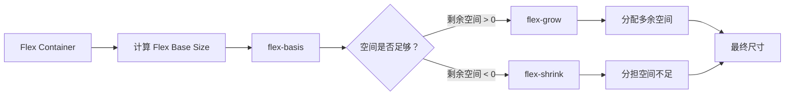
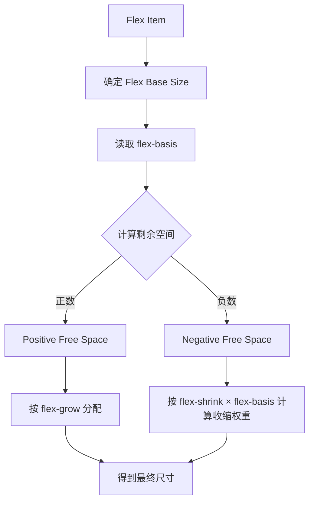
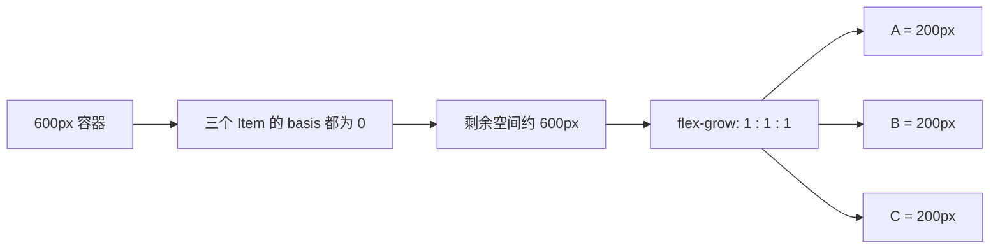
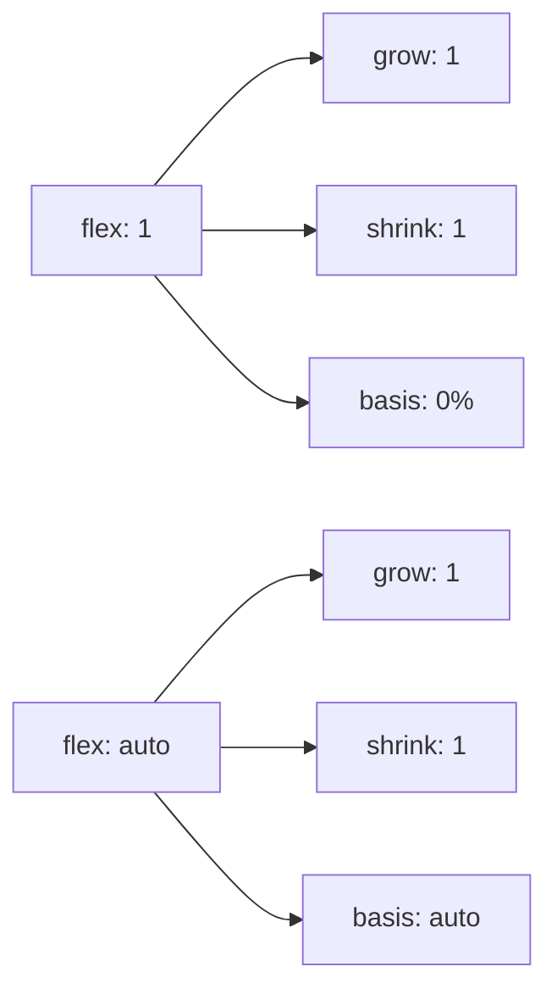
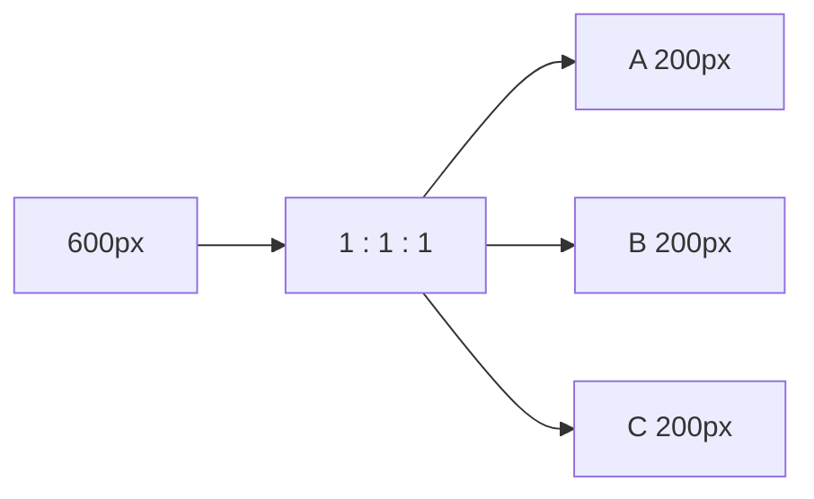
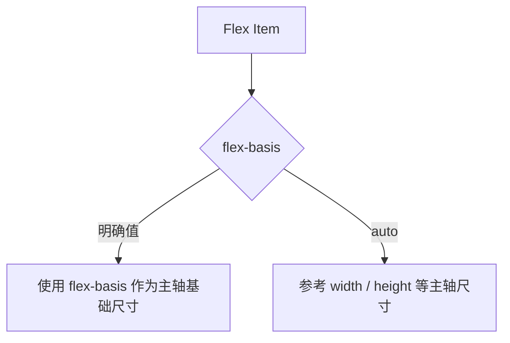
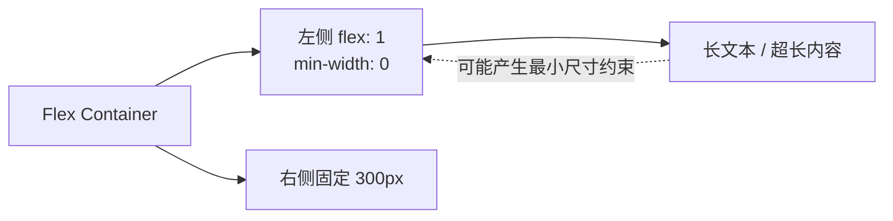
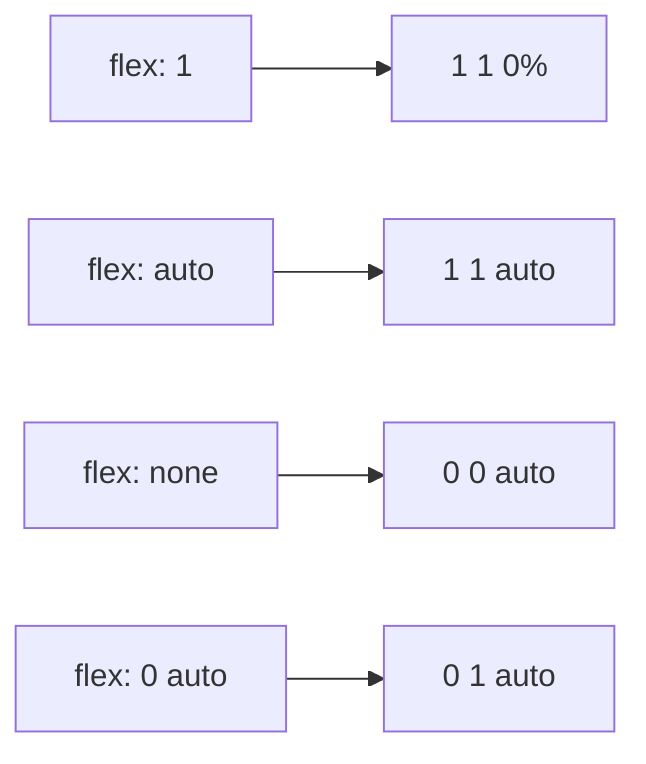
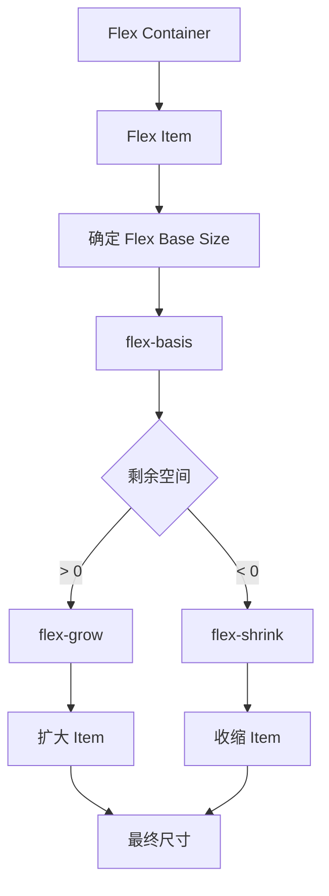

前端开发中，`display: flex` 几乎已经成为最常用的 CSS 布局方式之一。

但有一个很有意思的现象：很多工作了几年的前端开发，甚至每天都在使用 Flex 的人，遇到下面三个属性时依然容易混淆：

```css
flex-grow
flex-shrink
flex-basis
```

更典型的是：

```css
flex: 1;
```

和：

```css
flex: auto;
```

到底有什么区别？

很多时候我们会直接记住一句话：

> `flex: 1` 就是平均分配。

这句话在很多简单场景下确实“看起来是对的”，但它没有解释为什么。

其实理解 Flex 的关键并不在于死记三个属性，而在于把它看成一个**空间分配问题**：

> **先确定每个 Flex Item 的基础尺寸，再计算容器剩余多少空间，最后决定这些空间应该增长还是收缩。**

下面的交互式 Demo 可以边改参数边观察这个过程。

## 一、先把 Flex 想成“分配空间”

假设有一个 600px 宽的容器，里面有三个元素 A、B、C。

浏览器并不是简单地看到“三个元素”，然后直接做：

```text
600 ÷ 3 = 200px
```

它首先需要回答一个问题：

> **每个元素本来应该有多大？**

这个“基础尺寸”就是 Flex 中非常重要的概念：**Flex Base Size**。

而 `flex-basis` 正是影响这个基础尺寸的属性。

之后浏览器再计算：

```text
容器空间 - 所有 Item 的基础尺寸
```

结果可能是两种情况。这里用 Mermaid 把这个过程画出来：



所以可以先记住这句话：

> **`flex-basis` 决定从哪里开始算，`flex-grow` 决定多出来的怎么分，`flex-shrink` 决定不够的时候怎么缩。**

## 二、flex-basis：我本来想要多大？

最简单的情况：

```css
.item {
  flex-basis: 200px;
}
```

可以把它理解成：

> **在 Flex 主轴方向上，我的基础尺寸是 200px。**

例如容器宽度为 600px，三个 Item 都设置 `flex-basis: 200px`：

```text
A = 200px
B = 200px
C = 200px

总计 = 600px
```

刚好填满。

如果容器改成 800px：

```text
A = 200px
B = 200px
C = 200px

已经使用 = 600px

剩余 = 200px
```

这时候就轮到 `flex-grow` 出场了。

## 三、flex-grow：有多余空间，怎么分？

假设容器宽度为 800px，三个 Item 的 `flex-basis` 都是 200px。

三个元素先占：

```text
200 + 200 + 200 = 600px
```

容器有 800px，所以剩余：

```text
800 - 600 = 200px
```

如果三个元素都是：

```css
.a { flex-grow: 1; }
.b { flex-grow: 1; }
.c { flex-grow: 1; }
```

那么 200px 按照 `1 : 1 : 1` 分配，最终大约：

```text
A = 266.67px
B = 266.67px
C = 266.67px
```

如果改成：

```css
.a { flex-grow: 1; }
.b { flex-grow: 2; }
.c { flex-grow: 3; }
```

那么剩余空间按照 `1 : 2 : 3` 分配。

因此 `flex-grow` 真正表达的不是“我的宽度是多少”，而是：

> **如果还有剩余空间，我按照多大的比例参与分配。**

## 四、flex-shrink：空间不够，怎么缩？

`flex-grow` 解决的是“空间多了怎么办”，`flex-shrink` 解决的则是“空间不够怎么办”。

例如容器只有 500px，而三个 Item 的基础尺寸都是 200px：

```text
200 + 200 + 200 = 600px

需要压缩：
600 - 500 = 100px
```

如果三个元素都是：

```css
flex-shrink: 1;
```

在基础尺寸相同的情况下，最终大约是：

```text
A = 166.67px
B = 166.67px
C = 166.67px
```

这里有一个很容易被忽略的细节：

> **`flex-shrink` 不是简单地说“数值越大，就直接缩多少像素”。**

实际的收缩计算还会考虑 Flex Item 的基础尺寸。可以粗略理解为收缩权重与：

```text
flex-shrink × flex-basis
```

有关。

例如：

```css
.a {
  flex-basis: 100px;
  flex-shrink: 1;
}

.b {
  flex-basis: 300px;
  flex-shrink: 1;
}
```

如果两者共同面对空间不足，B 的基础尺寸更大，因此通常承担的收缩量也会更大。

所以：

> **`flex-shrink` 更准确地说是“空间不足时的收缩因子”，而不是一个直接的缩小像素值。**

## 五、三个属性放在一起就清楚了

| 属性 | 解决什么问题 | 可以理解成 |
| --- | --- | --- |
| `flex-basis` | 初始尺寸是多少 | 我本来想要多大？ |
| `flex-grow` | 空间有剩余怎么办 | 有多的，多给我多少？ |
| `flex-shrink` | 空间不够怎么办 | 不够的时候，我承担多少？ |

整个过程可以理解成：



这才是理解 Flex 的核心。

## 六、flex 是什么？

平时我们写：

```css
flex: 1;
```

其实 `flex` 是一个简写属性，它同时设置：

```text
flex-grow
flex-shrink
flex-basis
```

对于最常见的：

```css
flex: 1;
```

在实际布局中可以理解为：

```css
flex: 1 1 0%;
```

也就是：

```text
flex-grow   = 1
flex-shrink = 1
flex-basis  = 0%
```

注意最后这个 `0%`，它其实就是理解 `flex: 1` 的钥匙。

## 七、为什么 flex: 1 会“平均分配”？

假设容器宽度为 600px：

```css
.item {
  flex: 1;
}
```

三个 Item 都以相同的 grow 比例参与空间分配，而 basis 从 0 开始，因此最终得到：



所以真正值得记住的是：

> **`flex: 1` 并不是一个神奇的“平均分配”属性，而是让项目以 0 基础尺寸参与空间分配。**

“平均分配”只是 `grow` 相同情况下得到的结果。

## 八、flex: 1 和 flex: auto 到底差在哪里？

现在来看最容易混淆的一对：

```css
flex: 1;
```

和：

```css
flex: auto;
```

`flex: auto` 可以理解成：

```css
flex: 1 1 auto;
```

也就是：

```text
flex-grow   = 1
flex-shrink = 1
flex-basis  = auto
```

于是两者真正的差异就出来了：



**关键就在 `flex-basis`。**

## 九、flex: 1：大家从 0 开始分

假设三个元素自身的内容尺寸分别接近：

```text
A = 100px
B = 200px
C = 300px
```

容器宽度为 600px。

如果：

```css
.item {
  flex: 1;
}
```

参与空间分配时，三个项目的 basis 都近似为 0，于是：



所以即使内容长度不同，三个区域依然会尽量保持相同的空间。

## 十、flex: auto：先尊重自己的尺寸，再分剩余空间

如果换成：

```css
.item {
  flex: auto;
}
```

也就是：

```css
flex: 1 1 auto;
```

此时 `flex-basis: auto` 会让基础尺寸参考项目自身的主轴尺寸。

仍然假设：

```text
A = 100px
B = 200px
C = 300px
```

容器宽度为 900px：

```text
基础尺寸：100 + 200 + 300 = 600px

剩余空间：900 - 600 = 300px
```

三个元素的 grow 都是 1，因此剩余的 300px 平均增加：

```text
A = 200px
B = 300px
C = 400px
```

可以看到：


所以：

> `flex: 1` 更倾向于把项目做成相等尺寸；`flex: auto` 则保留项目原本的尺寸差异，再分配剩余空间。

## 十一、width 和 flex-basis 谁说了算？

这是实际开发中非常容易遇到的问题。

例如：

```css
.item {
  width: 200px;
  flex-basis: 300px;
}
```

当 `flex-basis` 不是 `auto` 时，在 Flex 主轴方向上，Flex sizing 会优先使用 `flex-basis` 作为基础尺寸，而不是简单按照 `width` 来计算。

因此可以把它粗略理解成：



所以如果你希望明确控制 Flex Item 在主轴上的起点，通常应该优先考虑 `flex-basis`。

## 十二、为什么有时候 flex: 1 还是撑破了？

还有一个非常经典的问题：

```css
.container {
  display: flex;
}

.left {
  flex: 1;
}

.right {
  width: 300px;
}
```

然后发现左侧内容很长，怎么都不愿意缩小，甚至把容器撑破。

很多时候问题并不是 `flex: 1` 失效，而是 **Flex Item 默认存在一个基于内容的最小尺寸**。

这也是为什么很多实际项目里会看到：

```css
.left {
  flex: 1;
  min-width: 0;
}
```

`min-width: 0` 的作用可以粗略理解成：

> **允许这个 Flex Item 在需要时真正缩到内容尺寸以下，而不是被长内容的最小尺寸卡住。**

尤其是下面这种布局非常常见：



因此，遇到“`flex: 1` 为什么还会撑爆”的问题时，`min-width: 0` 值得第一时间检查。

## 十三、为什么 flex: 1 里面的长文字还是会把布局撑爆？

这个问题和上一节密切相关。

例如：

```css
.parent {
  display: flex;
}

.child {
  flex: 1;
}
```

如果 `.child` 内部存在很长的不可断词文本、URL 或者某些不会自动换行的内容，那么内容本身可能形成一个较大的 min-content 尺寸。

这时候即使 `flex: 1` 已经参与了空间分配，最终尺寸仍然可能受到最小尺寸约束影响。

通常可以这样处理：

```css
.child {
  flex: 1;
  min-width: 0;
}
```

如果是长 URL、连续英文字符等，还可以进一步考虑：

```css
.child {
  overflow-wrap: anywhere;
}
```

所以这里有两个不同层面的事情：

- `flex: 1`：告诉浏览器这个项目如何参与 Flex 空间分配。
- `min-width: 0`：告诉浏览器不要让默认的最小尺寸约束阻止它继续缩小。

## 十四、顺便认识几个常见的 flex 简写

除了 `flex: 1`，下面几个也很常见：

| 写法 | 等价理解 | 常见用途 |
| --- | --- | --- |
| `flex: none` | `0 0 auto` | 完全不参与伸缩 |
| `flex: auto` | `1 1 auto` | 保留自身尺寸，同时参与伸缩 |
| `flex: 1` | `1 1 0%` | 常见的等分布局 |
| `flex: 0 auto` | `0 1 auto` | 不主动增长，但空间不足时可以收缩 |

可以把它们放到一张图里：



实际开发中，不需要把这些值全部死记下来。真正重要的是知道它们最终影响的是三个维度：

```text
grow / shrink / basis
```

## 十五、真正应该记住的，是这一张图

以后看到 Flex 布局，不妨在脑子里过一遍：



如果再进一步压缩成一句话，就是：

> **先看 basis，再看空间，空间多看 grow，空间少看 shrink。**

而 `flex: 1` 和 `flex: auto` 的核心区别，也终于可以归结到一个地方：

```text
flex: 1
→ 1 1 0%
→ basis 从 0 开始

flex: auto
→ 1 1 auto
→ basis 尊重自身尺寸
```

所以以后再看到：

```css
flex: 1;
```

不要再把它简单理解成“平均分配”。

更准确的理解应该是：

> **“我的基础尺寸按 0 参与 Flex 空间分配，如果有剩余空间，我按照 grow 比例拿走它。”**

这才是 Flex 真正值得理解的地方。
